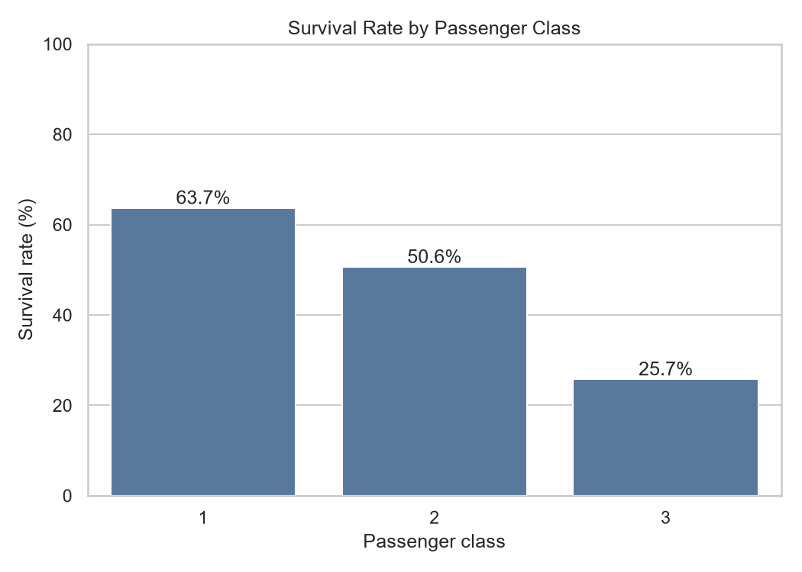
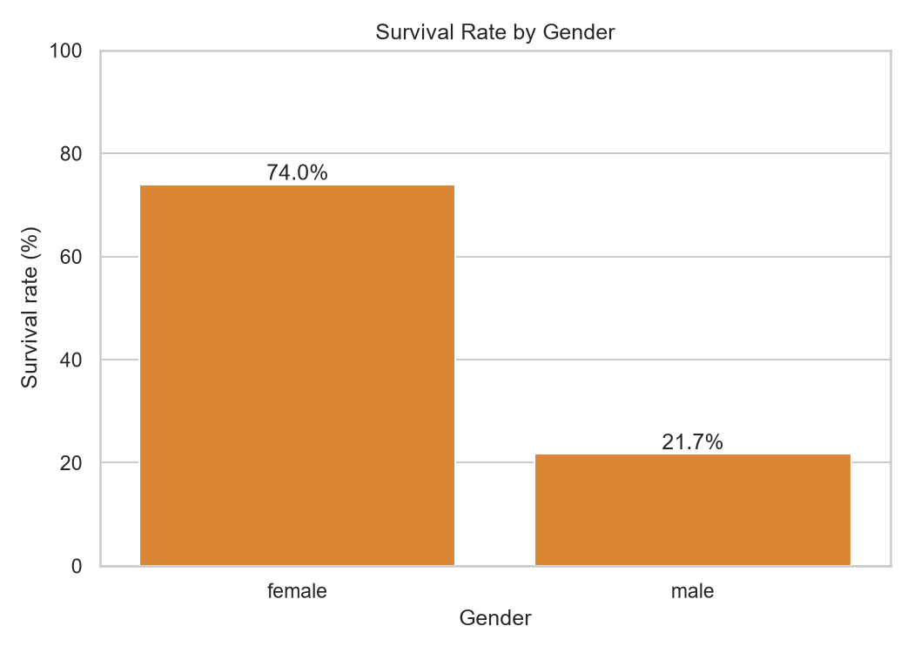
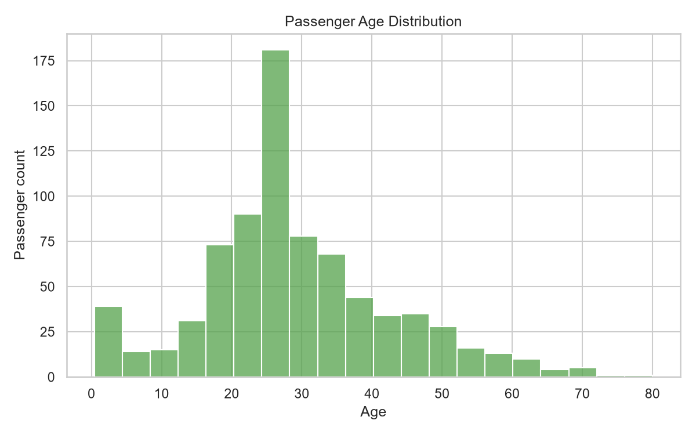
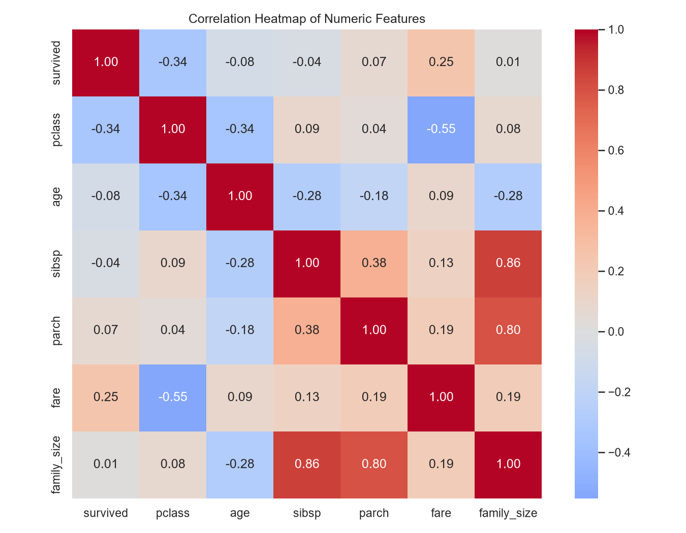

# AVIP 2026 Task 2: Titanic EDA

An exploratory data analysis project for AVIP 2026 Task 2. The project cleans the supplied Titanic passenger data, engineers family-related features, calculates survival statistics, and presents the findings in a notebook and an interactive Streamlit dashboard.

## Live Demo

[Open the live Titanic EDA dashboard](https://ds2titanicedabyte-mdwmgbluqtqe7fzckfdfdl.streamlit.app/)

## GitHub repository

[jpragati373-lab/DS_2_Titanic_EDA_byte](https://github.com/jpragati373-lab/DS_2_Titanic_EDA_byte)

## Dataset source

The analysis uses the Titanic CSV supplied in this repository at [`data/titanic.csv`](data/titanic.csv). The original CSV is preserved; cleaning is performed on a DataFrame copy. The source dataset contains 891 rows and 15 columns.

## Data cleaning

The notebook prepares `df_clean` from a copy of the source data and applies these steps:

- Removes 107 exact duplicate rows, retaining the first occurrence of each. After imputations, any rows that then became exact duplicates are removed as well.
- Fills missing `age` values with the median age calculated from the data.
- Fills missing values in `embarked` and `embark_town` with each column's mode.
- Drops `deck`, which has 688 missing values and is too incomplete for reliable imputation.
- Saves the resulting cleaned data to [`data/titanic_cleaned.csv`](data/titanic_cleaned.csv).

The cleaned analysis dataset has 780 rows. The cleaning code checks the resulting data for missing and duplicate rows.

## Feature engineering

- `family_size` is calculated as `sibsp + parch + 1`, including the passenger and their recorded siblings/spouse and parents/children.
- `is_alone` is `True` when `family_size` equals 1, and `False` otherwise.

## Required visualizations

The project creates four visualizations from the cleaned data:

1. Survival rate by passenger class
2. Survival rate by gender
3. Passenger age distribution
4. Correlation heatmap for numeric features

Charts are saved in `charts/` and included here as previews.

### Survival rate by passenger class



### Survival rate by gender



### Passenger age distribution



### Numeric feature correlation heatmap



## Key observations

The following results are calculated from the cleaned analysis data:

- Survival rates by passenger class are approximately 63.7% in first class, 50.6% in second class, and 25.7% in third class.
- The observed survival rate is approximately 74.0% for female passengers and 21.7% for male passengers.
- The cleaned age column has a median of 28.25 years; missing ages were filled with the median during cleaning.
- The numeric-feature correlation analysis reports associations only; it does not establish cause and effect.

## Conclusion

In this dataset, survival rates differ across both passenger class and gender groups. The cleaned age distribution and numeric correlation heatmap provide additional descriptive context. These are exploratory findings based on the repository's Titanic records and should not be interpreted as causal conclusions.

## Installation and running instructions

Run these commands from the repository root:

```bash
python -m pip install -r requirements.txt
streamlit run app.py
```

To open the notebook, launch Jupyter from the repository root:

```bash
jupyter notebook notebooks/titanic_eda.ipynb
```

## Project structure

```text
DS_2_Titanic_EDA_byte/
├── app.py
├── AVIP_SUBMISSION_CHECKLIST.md
├── charts/
│   ├── age_distribution.png
│   ├── correlation_heatmap.png
│   ├── survival_by_class.png
│   └── survival_by_gender.png
├── data/
│   ├── titanic.csv
│   └── titanic_cleaned.csv
├── notebooks/
│   └── titanic_eda.ipynb
├── README.md
└── requirements.txt
```

## AVIP 2026 Task 2

This repository contains the completed Titanic EDA project for AVIP 2026 Task 2, including the source and cleaned datasets, executed analysis notebook, generated visualizations, and an interactive Streamlit live demo.
